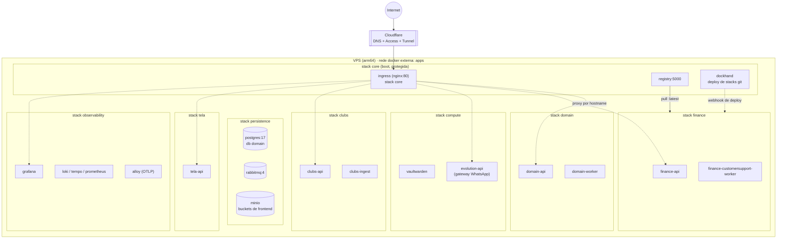
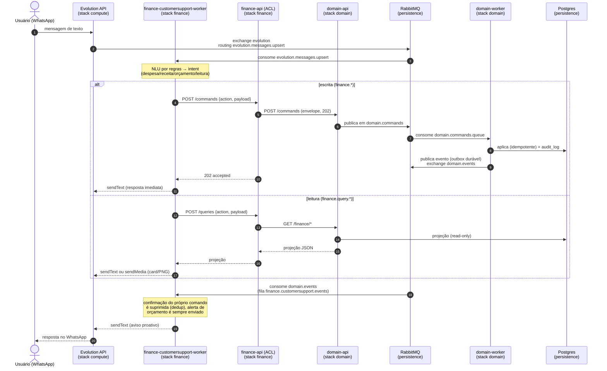
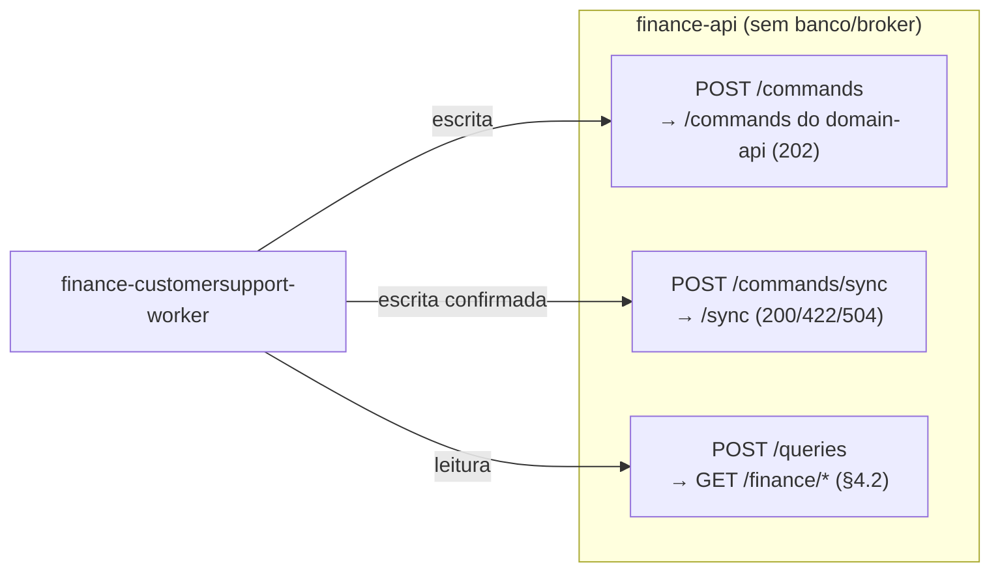
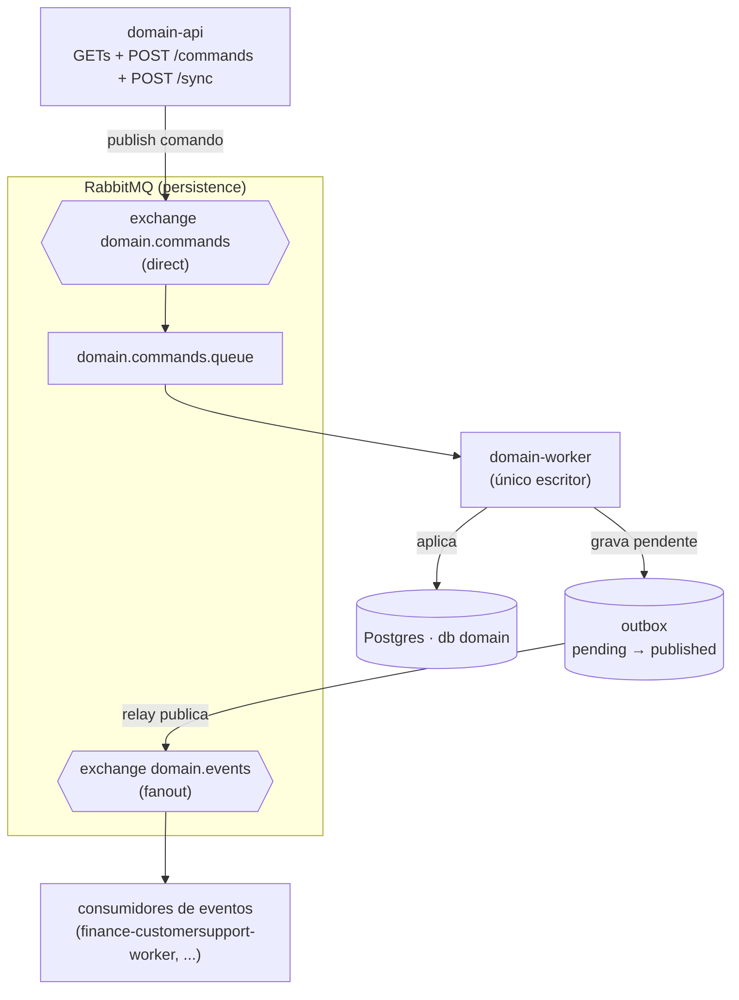
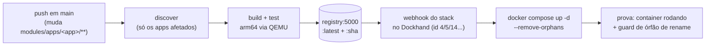

# Arquitetura

Visão da arquitetura **de hoje** neste repositório: apps, comunicação e
deploy. Cada diagrama abaixo foi conferido contra o código e os arquivos
`stacks/*.yml` — quando divergir, o código manda.

- **Stacks** (o que roda no host): `stacks/*.yml`, gerenciadas pelo Docker
  Compose via **Dockhand** (git-backed).
- **Apps** (o que é construído): `modules/apps/*`.
- **Contrato compartilhado**: `packages/finance-contracts` (envelope + eventos
  do contexto financeiro; importado por `finance-api` e pelo worker, nunca
  copiado).

---

## 1. Visão geral do host

Uma VPS (arm64) roda tudo em Docker Compose, na rede externa **`apps`**. O
**ingress** (nginx, no stack `core`) é a única porta 80/443; ele roteia por
hostname para cada serviço. Cloudflare fica na frente (DNS + Access).

> **Frontends não são containers.** `tela-frontend`, `clubs-frontend`,
> `hub-frontend` e `finance-frontend` são builds estáticos espelhados em
> buckets do MinIO; o ingress serve o bucket direto.

---

## 2. O contexto financeiro — fluxo WhatsApp (o coração)

O usuário fala por WhatsApp; o `finance-customersupport-worker` é o
**encarregado do atendimento** (conversa e avisos proativos). A
`finance-api` é a **ACL** (sem banco, sem broker): valida e repassa. O
`domain-api` é o front door do CQRS; o `domain-worker` é o **único
escritor** do banco. `packages/finance-contracts` é o contrato único.

**Regra de isolamento (§1.1):** nem a `finance-api` nem o worker têm
`DATABASE_URL`, driver de banco ou publicador de comando. Só o stack
`domain` toca o banco. O worker **consome** broker (Evolution + eventos de
domínio) e **fala HTTP** com a ACL.

### Superfícies da ACL

---

## 3. CQRS — broker e persistência (stack domain)

O `domain-api` publica comando; o `domain-worker` é o único escritor e
publica eventos via **outbox durável** (o evento é gravado como pendente
antes do publish; um relay reenvia o que ficou, at-least-once).

---

## 4. Deploy / CI-CD

Um pipeline por linguagem, auto-descoberto por arquivo (`go.mod`,
`pyproject.toml`) ou lista explícita (frontends). Cada um builda, testa,
publica `registry.giomartins.dev:5000/<app>:latest` + `:<sha>`, e chama o
**webhook do stack no Dockhand** (via SSH loopback no host).

- **Go** (`go-ci-cd.yml`): `domain-api`, `domain-worker`, `clubs-api`, `tela-api`.
- **Python** (`python-ci-cd.yml`): `clubs-ingest`, `finance-api`,
  `finance-customersupport-worker`.
- **TypeScript** (`ts-frontend-ci-cd.yml`): builds estáticos → buckets do MinIO.
- **Terraform** (`tf-ci-cd.yml`): Cloudflare DNS/Access + `host_baseline`.

---

## 5. Observabilidade

Todo app emite traces/métricas OTLP para o **alloy** (`:4318` e público em
`otel.giomartins.dev`); o stdout de todo container vai para o **loki**.
Dashboards no **grafana** (`grafana.giomartins.dev`, atrás de Access +
login). O `domain-api` e o worker usam `OTEL_SERVICE_NAME` por serviço.

---

## Referências

- `stacks/README.md` — os stacks, ordem de subida, segredos.
- `modules/apps/README.md` — cada app.
- `docs/finance-system-spec.md` — a spec do contexto financeiro (CQRS,
  invariantes, plano de teste).
- `modules/apps/domain-api/README.md` — contrato de escrita/leitura.
- `modules/apps/finance-api/README.md` — a ACL (endpoints, relays).
