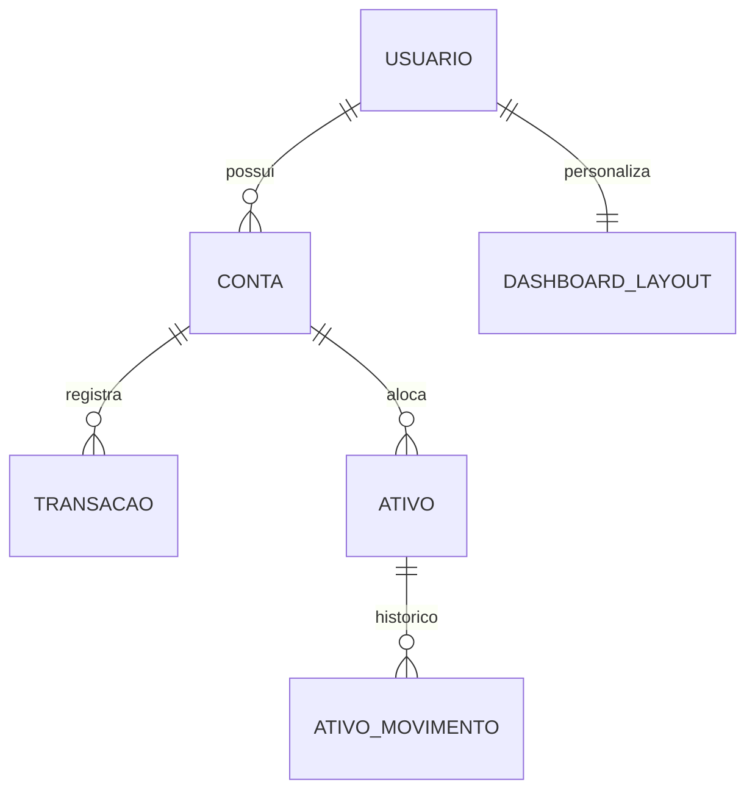

# Data Model: Gestão Financeira Modular

Todas as entidades abaixo são agregados novos do `domain-worker`/`domain-api`
compartilhados (tabelas no Postgres compartilhado, uma por agregado,
seguindo o padrão de `cch_rooms`/`cch_custom_decks`/`raw_deals`). Nenhum dos
4 microsserviços de módulo guarda estado próprio — eles apenas
orquestram chamadas à domain-api e, no caso do Asset Manager, mantêm um
cache em memória (não durável) das cotações.

## Usuário (identidade)

Não é um agregado novo — é a identidade resolvida pelo Cloudflare Access
(e-mail do JWT), reaproveitada em todos os 4 módulos como o campo
`usuario_email` de particionamento de dados (equivalente a
`dono_atual_email` no harness ou `email` em `bet_users`). Cada tabela nova
carrega esse campo e todo filtro de leitura é escopado por ele — é o que
garante FR-002 (isolamento entre pessoas usuárias).

## Conta

Representa uma conta financeira real (corrente ou investimento).

| Campo | Tipo | Notas |
|---|---|---|
| `id` | uuid | gerado na criação |
| `usuario_email` | string | dono da conta |
| `nome` | string | editável (FR-011) |
| `tipo` | enum `corrente`\|`investimento` | imutável após criação |
| `status` | enum `ativa`\|`arquivada` | arquivar em vez de excluir quando há vínculos (FR-012) |
| `criado_em`, `atualizado_em` | timestamp | |

**Regras de validação**: `tipo` só pode ser `corrente` ou `investimento`
(FR-010). Exclusão definitiva bloqueada se existir `Transacao` ou
`AtivoPosicao` referenciando a conta — nesse caso a API só aceita
`status=arquivada` (FR-012).

**Relacionamentos**: 1 conta → N transações (se `corrente`); 1 conta → N
posições de ativos (se `investimento`).

## Transação

Um lançamento de entrada ou saída em uma conta.

| Campo | Tipo | Notas |
|---|---|---|
| `id` | uuid | |
| `usuario_email` | string | |
| `conta_id` | uuid | FK lógica para `Conta` |
| `tipo` | enum `entrada`\|`saida` | |
| `valor` | decimal > 0 | validado (FR-024) |
| `data` | date | não pode ser inválida (FR-024) |
| `categoria` | string | livre ou de uma lista pré-definida (decisão de implementação) |
| `descricao` | string opcional | |
| `anexo_imagem` | blob/base64 opcional | preparação para OCR futuro (FR-023); não processado nesta fase |
| `criado_em`, `atualizado_em` | timestamp | |

**Regras de validação**: `valor` numérico e > 0; `data` válida; `conta_id`
deve referenciar uma conta existente e não arquivada no momento da criação
(edge case do spec).

**Relacionamentos**: N transações → 1 conta.

## Ativo (posição de investimento)

Uma posição de um ativo (ação, FII, etc.) alocada em uma conta de
investimento.

| Campo | Tipo | Notas |
|---|---|---|
| `id` | uuid | |
| `usuario_email` | string | |
| `conta_id` | uuid | deve referenciar uma conta do tipo `investimento` |
| `ticker` | string | código do ativo na B3 (ex.: `PETR4`, `MXRF11`) |
| `quantidade_atual` | decimal | soma líquida de compras/vendas |
| `custo_medio` | decimal | recalculado a cada movimento (FR-030) |
| `ultima_cotacao` | decimal | último valor de mercado conhecido (FR-035) |
| `ultima_cotacao_em` | timestamp | usado para sinalizar dado desatualizado |
| `status` | enum `aberta`\|`encerrada` | encerrada quando `quantidade_atual` chega a zero (FR-034) |
| `criado_em`, `atualizado_em` | timestamp | |

**Regras de validação**: `quantidade` de qualquer movimento > 0;
`conta_id` deve ser do tipo `investimento`.

**Relacionamentos**: N ativos → 1 conta; 1 ativo → N `AtivoMovimento`.

## AtivoMovimento

Histórico de eventos de uma posição: compra, venda ou provento recebido.

| Campo | Tipo | Notas |
|---|---|---|
| `id` | uuid | |
| `ativo_id` | uuid | FK lógica para `Ativo` |
| `tipo` | enum `compra`\|`venda`\|`provento` | |
| `quantidade` | decimal | obrigatório em `compra`/`venda`, N/A em `provento` |
| `preco_unitario` | decimal | obrigatório em `compra`/`venda` |
| `valor_provento` | decimal | obrigatório em `provento` |
| `data` | date | |
| `resultado_realizado` | decimal opcional | calculado em `venda` (FR-034) |
| `criado_em` | timestamp | append-only, sem edição (histórico) |

**Regras de validação**: `venda` não pode reduzir `quantidade_atual` do
ativo abaixo de zero.

## CotacaoCache (interno ao Asset Manager, não persistido via domain-api)

Não é uma entidade de domínio compartilhada — é o cache em memória do
processo `asset-manager-api`, chave por `ticker`, valor + timestamp da
última consulta bem-sucedida à brapi.dev, TTL curto. Serve só para reduzir
chamadas externas; a fonte de verdade "última cotação conhecida" que
sobrevive a um restart é o campo `ultima_cotacao`/`ultima_cotacao_em` do
agregado `Ativo` na domain-api.

## DashboardLayout

O layout personalizado (ou o marcador de "usa o padrão") de uma pessoa
usuária.

| Campo | Tipo | Notas |
|---|---|---|
| `id` | uuid | |
| `usuario_email` | string | 1 layout ativo por pessoa usuária (upsert) |
| `blocos` | json | lista de `Bloco` (ver abaixo) |
| `atualizado_em` | timestamp | |

### Bloco (elemento embutido em `blocos`, não é tabela própria)

| Campo | Tipo | Notas |
|---|---|---|
| `id` | string | identificador do bloco dentro do layout |
| `tipo_visualizacao` | enum `linha`\|`barra`\|`pizza`\|`indicador`\|`tabela` | FR-042 |
| `fonte_dados` | objeto | referência a conta(s), categoria de transação, ou carteira de ativos |
| `posicao` | `{x, y}` | grade do layout |
| `tamanho` | `{largura, altura}` | redimensionável (FR-041) |

**Regras de validação**: se `fonte_dados` referencia uma conta que foi
arquivada/excluída, o bloco continua salvo no layout mas a renderização
mostra um estado de "fonte indisponível" (edge case do spec), sem quebrar
o restante do dashboard.

**Relacionamentos**: 1 pessoa usuária → 1 `DashboardLayout` ativo (upsert,
não histórico). "Restaurar padrão" (FR-044) é uma operação client-side que
troca `blocos` pelo layout padrão embutido no frontend e salva como
qualquer outra edição — o padrão em si não precisa ser uma entidade
persistida.

## Diagrama de relacionamento (alto nível)

