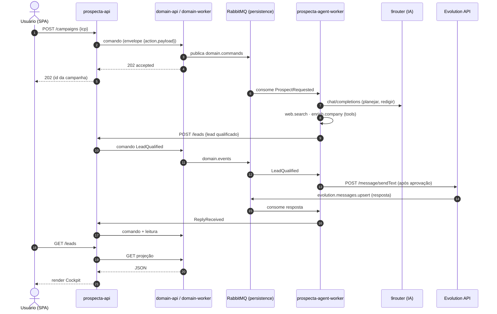

# Prospecta — Marketing Agêntico & Captação de Clientes

> **Status:** rascunho para revisão · **Branch:** `feat/prospecta`
> **Escopo:** especificação de produto + arquitetura (no padrão deste repo) +
> contrato de comunicação + plano de teste. O `poc.pen` (landing, design system,
> telas e diagrama de arquitetura) é a fonte visual canônica.

**Regra desta spec:** toda seção de infraestrutura descreve o que este
repositório **já faz hoje** (`stacks/*.yml`, `modules/apps/*`, `docs/*`). Nada de
inventar broker, banco ou deploy próprio. O que já roda (Evolution API, 9router,
RabbitMQ, Postgres, ingress, MinIO) é reutilizado por adapters — não
reimplementado.

> ⚠️ **CORREÇÃO DE DEPLOY (2026-10-07):** o commit `3201dcb` ("enxuga o Terraform
> para Cloudflare + rede + host_baseline") migrou os containers de **módulos
> Terraform** para **stacks git-backed do Dockhand** (`stacks/*.yml`). O TF raiz
> hoje só descreve **Cloudflare (DNS/Access), a rede `apps` e o `host_baseline`**
> — não há mais `provider "docker"`, `registry_host` nem `module.compute/*.apps`.
> Portanto: os containers do Prospecta são um **stack novo `stacks/prospecta.yml`**
> (molde de `stacks/finance.yml`), e o "módulo Terraform por app" descrito em
> `docs/novo-app-ci-cd.md` §4 está **obsoleto**. O **DNS** continua no TF: as
> entradas de hostname vão em `locals.tf` (`services`) + `variables.tf`
> (`excluded_hostnames`), aplicadas pelo `tf-ci-cd.yml`. Além disso, a **porta
> 8018 já é do `finance-api`** — o `prospecta-api` usa a **8022**.

---

## 1. Visão Geral

O **Prospecta** é um produto de **prospecção agêntica** para PMEs: a empresa
cadastra o próprio negócio, descreve o cliente ideal (ICP) em linguagem natural,
cria uma campanha e **agentes de IA vão atrás de prospects na web**, qualificam,
enriquecem e abordam por **e-mail e WhatsApp** — de forma autônoma, com
aprovação humana nas abordagens. O output não é uma lista de leads: é **pipeline
(reuniões agendadas)**.

Princípio central: **o produto é um time de prospecção autônomo**, não uma
ferramenta de marketing. A IA tem foco — prospecção, qualificação e abordagem.

### 1.1. Princípio fundamental — regra de isolamento (reuso do CQRS da casa)

> Nenhum serviço do Prospecta acessa o banco diretamente fora do par
> **`domain-api` (leitura) / `domain-worker` (único escritor)** existente. Os
> serviços de contexto validam invariantes e **traduzem comando para o envelope
> `{action, payload}`** da casa; a persistência e a consulta passam pelo par de
> domínio. O núcleo agêntico **nunca** toca o banco — fala HTTP tipado com as
> APIs de contexto e consome/publica eventos no broker.

Este desenho **não é novo**: é exatamente o que `finance-api` (ACL sem banco,
sem broker) + `finance-customersupport-worker` (Python, sem banco, consome
broker e fala HTTP) já fazem. O Prospecta reusa a camada:

- **`prospecta-agent-worker`** (Python 3.12, sem porta, **sem banco**) — o
  núcleo agêntico. Consome `ProspectRequested` e eventos do Evolution; orquestra
  os agentes (busca, enriquecimento, redação); chama o **9router** para IA; envia
  abordagem pela **Evolution API**. Como `finance-customersupport-worker`.
- **`prospecta-api`** (Go, 1 container, 1 host) — o BFF/ACL do contexto: rotas
  de leitura (síncronas, direto do par de domínio) e rotas de escrita (comando →
  `202`). Sem banco, sem driver.
- **`domain-api` / `domain-worker`** (existentes, estendidos) — donos da
  persistência. Ganham os agregados do Prospecta (§8) e são os únicos a deter
  `DATABASE_URL`.
- **`prospecta-frontend`** (React + Vite + TS, SPA estática em bucket, sem
  container) — implementa o design system do `poc.pen`.

### 1.2. Decisões (fechadas e abertas)

**Fechado:**

- **D1** — Núcleo agêntico em **Python 3.12** (mesmo runtime do
  `finance-customersupport-worker`), sem banco.
- **D2** — IA roteada pelo **9router** (já roda, stack `compute`,
  OpenAI-compatible em `https://ai.giomartins.dev/v1`). Nada de chave de OpenAI
  direta no serviço.
- **D3** — WhatsApp pela **Evolution API** (já roda, stack `compute`, Baileys).
  Entrada via RabbitMQ exchange `evolution`; saída via
  `POST /message/sendText/{instance}`.
- **D4** — Broker é o **RabbitMQ do stack `persistence`** (o mesmo do
  `domain`/`finance`). Rede externa `apps`.

| # | Decisão | Opções | Recomendação |
| --- | --- | --- | --- |
| D5 | Banco | (a) schemas `prospecta_*` no DB `domain` · (b) database próprio | **(a)** — segue `finance`/`clubs`; (b) exige bootstrap novo no `persistence.yml` |
| D6 | Stack | (a) stack nova `prospecta` · (b) entrar no stack `domain` | **(a)** — mesmo desenho do stack `finance` |
| D7 | Hostnames | nomes definitivos | `prospecta.giomartins.dev` (SPA), `prospecta-api.giomartins.dev` (API) |
| D8 | Acesso | SPA pública (iframe no hub), API com auth própria | SPA em `excluded_hostnames`; API com `X-API-Key`, sem Access |
| D9 | E-mail (saída) | SES vs Postmark vs SMTP | **decidir antes do M4** — default SES; domínio com SPF/DKIM/DMARC |
| D10 | Aprovação | (a) humano aprova toda abordagem · (b) autonomia total | **(a)** no MVP — guardrail `policy.approval=human` |

---

## 2. Personas & Jobs-to-be-done

| Persona | Job |
| --- | --- |
| **Marina — Head de Growth (PME)** | "Quero pipeline sem contratar SDR; descrevo meu ICP e recebo reuniões." |
| **Carlos — Dono de PME** | "Quero que alguém encontre e aborde clientes enquanto toco o negócio." |
| **Operação (interno)** | "Quero ver os agentes trabalhando, aprovar abordagens e garantir conformidade (LGPD/opt-out)." |

---

## 3. Escopo

### 3.1. Dentro do escopo (MVP)

- Cadastro da empresa + definição do ICP (linguagem natural).
- Criação de campanha e disparo de prospecção.
- Agentes que **buscam** prospects na web, **qualificam** (fit), **enriquecem**
  (decisor, e-mail corporativo) e **redigem** abordagem.
- Envio por **e-mail** e **WhatsApp** com **aprovação humana**.
- Inbox de **conversas** unificada (threads e-mail/WhatsApp) + resposta.
- **Pipeline**: leads, status, fit score, feed de atividade ao vivo.
- **Guardrails**: consentimento, opt-out, PII scrubbing, limites de autonomia.
- **Observabilidade**: OTel ponta a ponta.

### 3.2. Fora do escopo (por ora)

- Billing/self-service de planos (Stripe) — Fase 2.
- App mobile nativo — Fase 2 (o design prevê, o MVP não entrega).
- Marketplace de templates de campanha — Fase 3.

---

## 4. Arquitetura

Núcleo event-driven. Os agentes são um runtime **isolado**; a comunicação entre
serviços é por **eventos** no RabbitMQ (exchange `domain.events`/`evolution`) e
por **HTTP tipado** (X-API-Key) entre worker agêntico → APIs de contexto → par de
domínio.

```
┌──────────────────────────────────────────────────────────────┐
│  prospecta-frontend (SPA estática em bucket, sem container)  │
│  Cockpit · Campanhas · Leads · Conversas · Configurações      │
└───────────────────────────┬──────────────────────────────────┘
                            │ HTTPS (X-API-Key) — leitura + comando
                            ▼
┌──────────────────────────────────────────────────────────────┐
│  prospecta-api (Go, 1 host: prospecta-api.giomartins.dev)    │
│  ├─ leitura  → par de domínio (GET projeções)                 │
│  ├─ escrita  → publica comando no RabbitMQ  → 202             │
│  sem banco · sem DATABASE_URL · sem driver                    │
└───────────────────────────┬──────────────────────────────────┘
                            │ HTTP (X-API-Key) → domain-api
                            ▼
┌──────────────────────────────────────────────────────────────┐
│  domain-api / domain-worker (stacks domain) — ÚNICOS donos do │
│  banco. Aplicam o comando (idempotente) e publicam evento.     │
└───────────────────────────┬──────────────────────────────────┘
                            │ RabbitMQ (domain.events, fanout)
                            ▼
┌──────────────────────────────────────────────────────────────┐
│  prospecta-agent-worker (Python 3.12, SEM PORTA, SEM BANCO)   │
│  Orchestrator · LLM Gateway → 9router · Tool Adapters ·        │
│  Agent Memory (pgvector via API) · Guardrails                 │
│  entrada: consome ProspectRequested + evolution.messages.upsert│
│  saída:   POST /message/sendText (Evolution) · comandos HTTP   │
└───────────────────────────┬──────────────────────────────────┘
                            │
   ┌────────────────────────┼────────────────────────┐
   ▼                        ▼                        ▼
┌──────────┐        ┌──────────────┐         ┌──────────────┐
│ 9router  │        │ Evolution API│         │ RabbitMQ     │
│ (IA)     │        │ (WhatsApp)   │         │ (persistence)│
│ stack    │        │ stack compute│         │ + Postgres   │
│ compute  │        │              │         │ + pgvector   │
└──────────┘        └──────────────┘         └──────────────┘
```

**Notas de transporte (o que o repo já tem):**

- **Entrada WhatsApp → agente:** A Evolution publica **todo** evento no RabbitMQ
  do `persistence` — exchange topic `evolution`, routing key
  `evolution.<evento>`, fila global por evento. O worker consome
  **`evolution.messages.upsert`** (payload v2.3.7:
  `{event, instance, data:{key:{remoteJid, fromMe}, message:{conversation |
  extendedTextMessage.text}, pushName, messageTimestamp}, ...}`). Sem webhook
  HTTP, sem `X-Hub-Signature` (isso era Meta).
- **Saída agente → WhatsApp:** `POST {EVOLUTION_API_URL}/message/sendText/{instance}`
  com header `apikey: {EVOLUTION_API_KEY}` e corpo
  `{"number": "<E.164 sem +>", "text": "<texto>"}`. Instância via
  `EVOLUTION_INSTANCE` (default `web-businesses`).
- **IA:** `POST {NINEROUTER_BASE_URL}/chat/completions` (OpenAI-compatible),
  base `https://ai.giomartins.dev/v1`. `NINEROUTER_BASE_URL` é env; a chave,
  se exigida, via Vault.
- **Broker:** o RabbitMQ do `stacks/persistence.yml` (usuário `domain`), rede
  externa `apps`. O worker **consome** (eventos de domínio + Evolution) e
  **publica** eventos próprios (`prospecta.*`).
- **Observabilidade:** OTLP para `alloy:4318`; stdout → loki. `OTEL_SERVICE_NAME`
  por serviço.

---

## 5. Fluxo principal (event-driven — front → back → db)

Cada passo mostra a informação passando pelas camadas. **Front** nunca fala
banco; **escrita** sempre vira comando `202`; o **worker de domínio** é o único
escritor.

| # | Fluxo | Caminho |
| --- | --- | --- |
| 1 | **Cadastrar empresa** | FRONT `form` → API `POST /companies` → BUS `CreateCompany` → WORKER domínio → DB `prospecta_company` |
| 2 | **Criar campanha** | FRONT `prompt do ICP` → API `POST /campaigns` → BUS `CreateCampaign` → WORKER → DB → BUS `CampaignStarted` |
| 3 | **Agente prospecta** | BUS `ProspectRequested` → WORKER agêntico → EXT `web.search` + `enrich.company` (9router) → BUS `LeadDiscovered/Enriched` → WORKER domínio → DB `prospecta_lead` |
| 4 | **Aprovar abordagem** | FRONT aprova → API `POST /messages` → BUS `SendMessage` → WORKER messaging → EXT Evolution `sendText` / e-mail → DB `prospecta_conversation` |
| 5 | **Resposta do cliente** | EXT Evolution → BUS `evolution.messages.upsert` → WORKER agêntico → BUS `ReplyReceived` → DB → FRONT `Conversas` atualiza |
| 6 | **Leitura (Cockpit)** | FRONT abre → API `GET /leads` → par de domínio → DB `prospecta_lead` → FRONT render |



---

## 6. Responsabilidades por serviço

| Serviço | Linguagem | Porta | Banco | Papel |
| --- | --- | --- | --- | --- |
| `prospecta-frontend` | TS/React/Vite | — | — | SPA estática em bucket (Cockpit, Campanhas, Leads, Conversas, Config) |
| `prospecta-api` | Go 1.25 | 8018 | — | BFF/ACL: leitura + comando `202`; sem driver de banco |
| `prospecta-agent-worker` | Python 3.12 | — | — | Núcleo agêntico: orquestra agentes, chama 9router, consome Evolution |
| `domain-api` / `domain-worker` | Go 1.25 | 8000 | sim | Donos do banco; agregados do Prospecta |
| `packages/prospecta-contracts` | Python | — | — | Envelope + eventos `prospecta.*` (contrato único, importado, não copiado) |

---

## 7. Contrato de comunicação

### 7.1. Eventos de domínio publicados (exchange `domain.events`)

| Evento | Publicado por | Consumido por |
| --- | --- | --- |
| `CompanyRegistered` | domain-worker | prospecta-agent-worker |
| `ICPDefined` | domain-worker | prospecta-agent-worker |
| `CampaignStarted` | domain-worker | prospecta-agent-worker |
| `ProspectRequested` | domain-worker | prospecta-agent-worker |
| `LeadDiscovered` | prospecta-agent-worker | domain-worker |
| `LeadEnriched` | prospecta-agent-worker | domain-worker |
| `LeadQualified` | domain-worker | prospecta-agent-worker |
| `MessageDrafted` | prospecta-agent-worker | domain-worker |
| `MessageApproved` | domain-worker | prospecta-agent-worker |
| `MessageSent` | prospecta-agent-worker | domain-worker |
| `ReplyReceived` | prospecta-agent-worker | domain-worker |
| `MeetingBooked` | prospecta-agent-worker | domain-worker |

### 7.2. Comandos (envelope `{action, payload}`)

`CreateCompany`, `DefineICP`, `CreateCampaign`, `StartCampaign`,
`RequestProspect`, `UpsertLead`, `QualifyLead`, `DraftMessage`, `ApproveMessage`,
`SendMessage`, `ReceiveReply`, `BookMeeting`.

### 7.3. Endpoints da `prospecta-api`

- `POST /companies` · `GET /companies/{id}`
- `POST /companies/{id}/icp`
- `POST /campaigns` · `GET /campaigns` · `GET /campaigns/{id}`
- `POST /campaigns/{id}/start`
- `GET /leads` · `GET /leads/{id}` · `POST /leads/{id}/qualify`
- `GET /conversations` · `GET /conversations/{id}` · `POST /messages`
- `POST /messages/{id}/approve`
- `GET /agent/activity` (feed SSE — streaming de atividade)

Detalhamento em [`contracts/`](./contracts/).

---

## 8. Modelo de dados (DB `domain`, schemas `prospecta_*`)

| Tabela | Campos-chave |
| --- | --- |
| `prospecta_company` | `id`, `tenant_id`, `name`, `site`, `description`, `created_at` |
| `prospecta_icp` | `company_id`, `definition` (texto natural), `signals[]`, `embedding` (pgvector) |
| `prospecta_campaign` | `id`, `company_id`, `icp_id`, `channels[]`, `status`, `created_at` |
| `prospecta_lead` | `id`, `campaign_id`, `company_name`, `segment`, `channel`, `fit`, `status`, `source_url`, `enriched{}` |
| `prospecta_message` | `id`, `lead_id`, `channel`, `direction`, `content`, `status`, `sent_at` |
| `prospecta_conversation` | `id`, `lead_id`, `thread_key`, `state` |
| `prospecta_agent_run` | `id`, `campaign_id`, `agent`, `state`, `started_at`, `ended_at`, `metrics{}` |
| `prospecta_audit_log` | `id`, `tenant_id`, `command`, `status`, `payload`, `created_at` |

Reuso: **pgvector** para embeddings do ICP e busca semântica de prospects;
`RLS` multi-tenant por `tenant_id`. Ver
[data-model.md](./data-model.md).

---

## 9. Guardrails & conformidade (LGPD)

- **Consentimento/opt-out:** toda abordagem carrega opt-out claro; a lista de
  opt-out é consultada **antes** de todo envio e nunca é contornada.
- **PII scrubbing:** remoção de PII sensível antes de mandar contexto ao 9router;
  nunca logar telefone/e-mail completos.
- **Dados públicos:** a busca de prospects usa fontes públicas; scraping respeita
  `robots.txt` e limites de taxa.
- **Autonomia:** no MVP (`D10`), **humano aprova** cada abordagem
  (`policy.approval=human`); envio automático é Fase 2, atrás de flag por tenant.
- **Auditoria:** todo comando vira `prospecta_audit_log` (sucesso **ou** falha),
  no padrão do `domain-worker`.

---

## 10. Plano de teste (feature-first TDD — padrão do repo)

Testes são **integração** com `.feature` (Gherkin) + steps `pytest-bdd` +
testcontainers reais — ver `.claude/skills/feature-first-tdd/SKILL.md`. Não há
tier de unit test. Cada serviço exige `--cov-fail-under=90`.

| Serviço | Infra real (testcontainers) | Foco |
| --- | --- | --- |
| `prospecta-api` | Postgres (via par de domínio) + RabbitMQ | leitura projeta; comando → 202; `X-API-Key` obrigatória; idempotência |
| `prospecta-agent-worker` | RabbitMQ + upstream HTTP (evolution/9router falsos em container) | consome fila; chama 9router (mock HTTP real); parse do payload Evolution; opt-out bloqueia envio |
| `domain-*` (extensões) | Postgres + MinIO | agregados `prospecta_*`; outbox durável; audit para sucesso e falha |

Três tipos por cenário: **positivo**, **negativo** (input inválido, sem auth,
downstream falha) e **edge** (vazio, limites 0/1/N, idempotência, id inexistente).

---

## 11. Referências

- `poc.pen` — landing, design system, telas e diagrama de arquitetura.
- `docs/architecture.md` — arquitetura do host (stacks, ingress, deploy).
- `docs/finance-system-spec.md` — o análogo mais próximo (ACL sem banco + worker).
- `docs/novo-app-ci-cd.md` — receita de app novo neste repo.
- `stacks/compute.yml` — Evolution API + 9router.
- `.claude/skills/feature-first-tdd/SKILL.md` — regra de teste.
